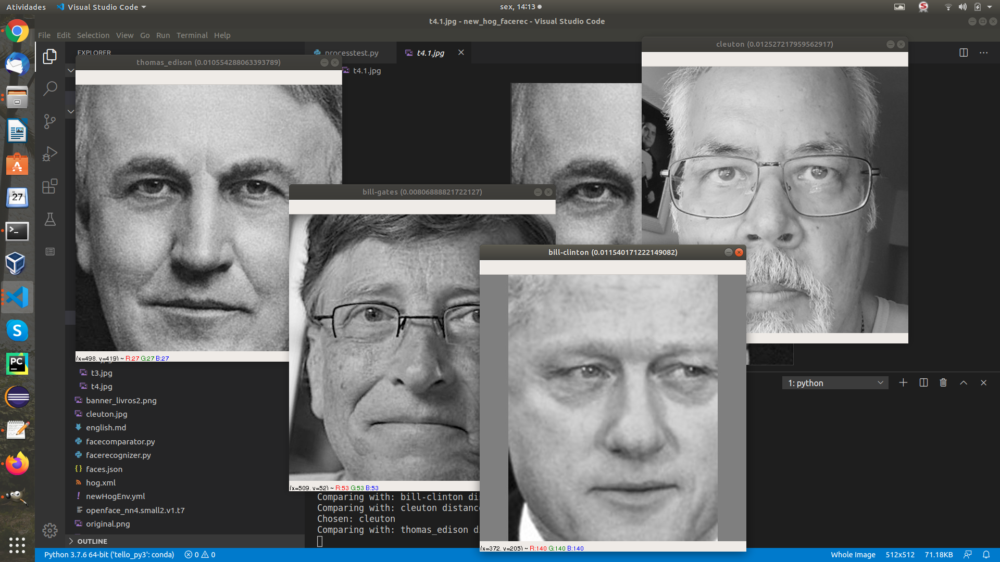

Naive Face Recognition Pipeline using OpenCV

[**Cleuton Sampaio**](https://github.com/cleuton)

[**ENGLISH VERSION HERE**](./english.md)

[](https://www.lcm.com.br/site/#livros/busca?term=cleuton)



Esta aplicação é a demonstração de um **pipeline** de reconhecimento facial, baseado apenas na biblioteca **OpenCV**. Eu já tenho outros projetos de reconhecimento facial, como: 
- [**Reconhecimento Facial com CNN usando Keras e Tenrsorflow**](https://github.com/cleuton/facerec_cnn);
- [**Comparação de rostos com Java e C++ utilizando HOG**](https://github.com/cleuton/hogcomparator);
- [**Drone Facerec**](https://github.com/cleuton/drone-facerec);

O que há de diferente neste projeto aqui? Ele é mais simples e mais fácil de instalar e utilizar. Alguns, como o [**facerec_cnn**](https://github.com/cleuton/facerec_cnn) exigem compilação de bibliotecas C++, o que pode gerar problemas para os desenvolvedores.

Este projeto utiliza apenas a biblioteca [**OpenCV**](https://opencv.org/) pré cpmpilada e com **bindings** para **python**, podendo ser instalada via **pip**.

E eu uso também um modelo de rede neural pré treinado do [**OpenFace**](https://cmusatyalab.github.io/openface/) para extrair os **128** [**face embeddings**](https://machinelearningmastery.com/how-to-develop-a-face-recognition-system-using-facenet-in-keras-and-an-svm-classifier/) de modo a comparar um rosto com outro.

## Pipeline

De acordo com o artigo do [**OpenFace**](https://cmusatyalab.github.io/openface/) o fluxo de reconhecimento facial é mais ou menos assim: 


A parte inicial do pipeline é a transformação das imagens utilizadas: 

1. **Input image**: Ler a imagem (original ou de teste);
2. **Detect**: Detectar rostos na imagem;
3. **Transform**: Para cada rosto na imagem, alinhar e ajustar a escalar;
4. **Crop**: Recortar cada rosto da imagem original, e gerar uma nova imagem.

Toda essas 4 etapas iniciais são feitas com o meu projeto [**SimpleFace**](https://github.com/cleuton/simpleface), cujo script [**pythonfaces**](./pythonfaces.py) foi copiado aqui.

A próxima etapa é extrair o vetor 128D de *face embeddings* e armazena-lo para futuras comparações. 

Você pode usar um modelo de classificação para classificar as pessoas, ou simplesmente pode usar algo mais simples, como a [**distância euclidiana**](https://pt.wikipedia.org/wiki/Dist%C3%A2ncia_euclidiana) entre dois vetores de embeddings, identificado pela menor distância encontrada. 


Essa parte é feita pelo script [**facerecognizer.py**](./facerecognizer.py), que usa a nova biblioteca [**facecomparator.py**](./facecomparator.py) que eu criei para este projeto. 

O script [**facerecognizer.py**](./facerecognizer.py) é o principal script deste pipeline e é ele quem compara cada imagem de teste com o **banco de dados de embeddings**, dizendo de quem é a foto.

O pipeline é assim: 


A primeira parte (rótulo "1") são as 4 primeiras etapas do pipeline, executadas pelos scripts: 
- [**processfaces.py**](./processfaces.py): Que lê as imagens da pasta "**original**", prepara e grava na pasta "**processed**" (apenas para futura referência, pois não são mais utilizadas), e cria um **banco de dados json** com os nomes e embeddings de cada rosto encontrado [**faces.json**](./faces.json);
- [**processtest.py**](./processtest.py): Que apenas prepara as fotos de teste (não entram no banco de embeddings), gerando imagens monocromáticas dos rostos com 512 x 512 pixels, para facitilar o reconhecimento.

Para rodar é só executar ambos os scripts (sem passar argumentos).

A segunda parte é o reconhecimento em si. O script [**facerecognizer.py**](./facerecognizer.py) carrega o **banco de dados faces.json** e lê cada foto da pasta "**test**", tentando reconhecer e exibindo na tela com o nome que ele encontrou. 

## Qualidade das imagens

Eu uso apenas o **OpenCV** e o modelo do **OpenFace** para isto. A [**Dlib**](http://dlib.net/) tem um algoritmo de detecção de rostos e reconhecimento facial mais preciso e eu já demonstrei isso no projeto [**Hog Comparator**](https://github.com/cleuton/hogcomparator), porém, é mais lento e difícil de instalar e configurar. 

Para a detecção de rostos funcionar, é preciso que a imagem original (na pasta "**original**") seja grande (pelo menos 512 x 512 pixeis), e o contraste do rosto com o fundo esteja bem demarcado. Também é preciso que a face esteja bem iluminada. Aplicar um filtro **Sharpen** pode ajudar. As imagens de teste (na pasta "**test_source**") também devem ser tratadas da mesma maneira.

O programa [**facerecognizer.py**](./facerecognizer.py) varre o banco inteiro, comparando os embeddings de cada foto de teste com cada embedding armazenado, escolhendo o de menor distância. 

## Instalação

Clone este repositório! Se você tiver o [**Anaconda**](https://anaconda.org/) basta criar um ambiente com o arquivo anexo: 

```
conda env create -f naive.yml
conda activate naive
```

Para testar basta rodar o programa [**pythonfaces.py**](./pythonfaces.py): 

```
python pythonfaces.py |imagem.jpg|
```

Ele possui dois outros parâmetros: 

```
python pythonfaces.py |imagem.jpg| |face cascade model| |eye cascade model|
```

Se você informar apenas a imagem, ele assumirá os arquivos que estão na pasta "./data/haarcascades".

O programa detecta os rostos na imagem passada, extraindo cada um deles em uma nova imagem. Ele transforma em monocromática, alinha o rosto (alinha os olhos na horizontal) e corta o rosto da pessoa, em uma forma quadrada no tamanho que você quiser. 


