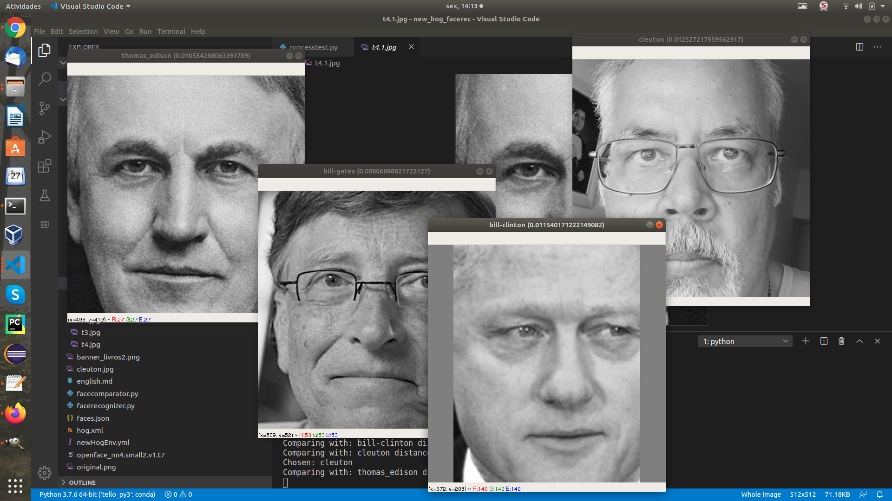

Naive Face Recognition Pipeline using OpenCV

[**Cleuton Sampaio**](https://github.com/cleuton)

[](https://www.lcm.com.br/site/#livros/busca?term=cleuton)



This application is the demonstration of a **facial recognition pipeline**, based only on the **OpenCV** library. I already have other facial recognition projects, such as:
- [**Facial recognition with CNN using Keras and Tenrsorflow**](https://github.com/cleuton/facerec_cnn);
- [**Comparison of faces with Java and C ++ using HOG**](https://github.com/cleuton/hogcomparator);
- [**Drone Facerec**](https://github.com/cleuton/drone-facerec);

What's different about this project here? It is simpler and easier to install and use. Some other projects like [**facerec_cnn**](https://github.com/cleuton/facerec_cnn) require compilation of C ++ libraries, which can cause problems for developers.

This project uses only the [**OpenCV**](https://opencv.org/) library, pre-compiled and with **bindings** for **python**, and can be installed via **pip**.

And I also use a pre-trained neural network model from [**OpenFace**](https://cmusatyalab.github.io/openface/) to extract the **128** [**face embeddings**]( https://machinelearningmastery.com/how-to-develop-a-face-recognition-system-using-facenet-in-keras-and-an-svm-classifier/) in order to compare one face with another.

## Pipeline

According to the [**OpenFace**](https://cmusatyalab.github.io/openface/) article, the flow of facial recognition looks something like this:


The initial part of the pipeline is the transformation of the images used:

1. **Input image**: Read the image (original or test);
2. **Detect**: Detect faces in the image;
3. **Transform**: For each face in the image, align and adjust to scale;
4. **Crop**: Crop each face of the original image, and generate a new image.

All these 4 initial steps are done with my project [**SimpleFace**](https://github.com/cleuton/simpleface), that I've provided also here (pythonfaces.py).

The next step is to extract the 128D vector *face embeddings* and store it for future comparisons.

You can use a classification model to classify people, or you can simply use something simpler, such as [**Euclidean distance**](https://en.wikipedia.org/wiki/Euclidean_distance) between two embeddings vectors, identified by the shortest distance found.


This part is done by the script [**facerecognizer.py**](.facerecognizer.py), which uses the new library [**facecomparator.py**](./facecomparator.py) that I created for this project .

The [**facerecognizer.py**](./facerecognizer.py) script is the main script in this pipeline and it is he who compares each test image with the **embeddings database**, saying whose photo it is.

The pipeline looks like this:


The first part (label "1") are the first 4 steps of the pipeline, performed by the scripts:
- [**processfaces.py**](./processfaces.py): Reads images from the "**original**" folder, prepares and writes to the "**processed**" folder (for future reference only, because they are no longer used), and creates a **json database** with the names and embeddings of each face found [**faces.json**](./faces.json);
- [**processtest.py**](./processtest.py): That only prepares the test photos (which are not stored in the embeddings database), generating monochrome images of the faces with 512 x 512 pixels, to facilitate recognition.

To run, just run both scripts (without passing arguments).

The second part is the recognition itself. The [**facerecognizer.py**](./facerecognizer.py) script loads the **faces.json** database and reads each photo in the "**test**" folder, trying to recognize and display it on the screen with the name he found.

## Images quality

I only use * OpenCV** and the **OpenFace** model for this. [**Dlib**](http://dlib.net/) has a more accurate face detection and facial recognition algorithm and I already demonstrated that in the [**Hog Comparator**](https://github.com/cleuton/hogcomparator) project, however, it is slower and more difficult to install and configure.

For face detection to work, the original image (in the "**original**" folder) must be large (at least 512 x 512 pixels), and the contrast of the face and the background must be well demarcated. The face must also be well lit. Applying a **Sharpen** filter can help. Test images (in the "**test_source**" folder) must also be treated in the same way.

The program [**facerecognizer.py**](./facerecognizer.py) scans the entire bank, comparing the embeddings of each test photo with each stored embedding, choosing the shortest distance.

## Installation

Clone this repository! If you have [**Anaconda**](https://anaconda.org/) just create an environment with the attached file:

```
conda env create -f naive.yml
conda activate naive
```

To test just run the program [**pythonfaces.py**](./pythonfaces.py):

```
python pythonfaces.py | imagem.jpg |
```

It has two other parameters:

```
python pythonfaces.py | imagem.jpg | face cascade model | | eye cascade model |
```

If you enter only the image, it will assume the files that are in the "./data/haarcascades" folder.

The program detects the faces in the past image, extracting each one in a new image. It transforms into monochrome, aligns the face (aligns the eyes horizontally) and cuts the person's face into a square shape to the size you want.


